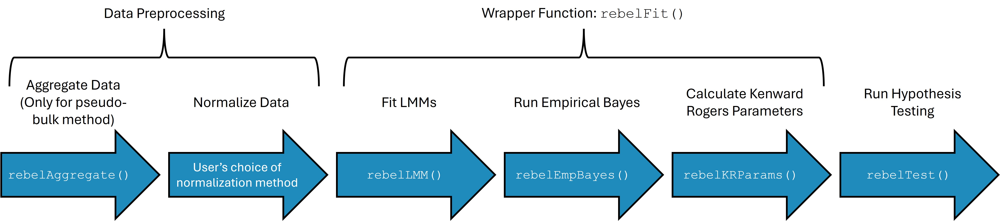

# Intro to REBEL

## Introduction

REBEL is an R package for analyzing cell-type specific differential
expression in longitudinal and other repeated measure scRNA-seq studies.
This package implements a method using a linear mixed model (LMM)
framework with an empirical Bayes process to improve estimation of
residual and random effect variance by sharing information across genes.
This method uses either cell-level data, in which case random intercepts
for subject and sample are used to account for correlation in the data,
or pseudo-bulk data, in which case cell-level counts are aggregated
across cells and a random intercept for subject is included in the
model. Models can be fit with multiple fixed effects including group
variables that vary on a subject level (i.e. disease vs control),
variables that vary within a subject, such as time related variables
(i.e. baseline, follow-up), and interaction effects. Hypothesis testing
is performed on model coefficients or linear contrasts using
Kenward-Roger degrees of freedom estimated using empirical Bayes
variance estimates.

## Installation

REBEL is available on github at: <https://github.com/ewynn610/REBEL>.

It can be installed using:

``` r

if (!requireNamespace("devtools", quietly = TRUE)) {
  install.packages("devtools")
}
devtools::install_github("https://github.com/ewynn610/REBEL")
```

## Package Framework

REBEL is designed to test for differential expression for covariates
within a *single* cell type or subpopulation of cells. The package
workflow begins using scRNA-seq data that has been processed and data
has been filtered to a cell type of interest.

Figure 1 shows the basic workflow of the REBEL package which can be
split into three sections:

- Data preprocessing: aggregating data (pseudo-bulk option only) and
  applying a normalizing transformation to the counts.

- Fitting REBEL models: fitting LMM’s, calculating empirical Bayes
  variance estimates, calculating parameters that are used for the
  Kenward Roger’s degrees of freedom method.

- Hypothesis testing: performing tests for differential expression for
  model fixed effects.



Figure 1: Basic package workflow

We will provide a more in depth of this process using a real example.

## Simulation and processing of Example Data

We use data simulated using the `rescueSim` package, which can be used
to simulate single-cell type longitudinal scRNA-seq data. We use preset
simulation parameters available in the package, but parameters can also
be estimated from empirical data.

We simulated data with a two group (ex. control group, treatment group),
two timepoint (ex. baseline, follow-up) design and simulate 5 subjects
for each group (10 total subjects, 20 samples). Data is simulated so
that 20% of genes are differentially expressed with a log-fold change of
0.5 between the group1 at time1 and all other group/time combinations.
Samples were simulated to have between 50 and 150 cells with the number
of cells per sample drawn from a discrete uniform distribution. To
decrease computation times for this example, we analyze only the first
100 genes in the simulated data.

``` r

library(rescueSim)
library(SummarizedExperiment)
library(REBEL)

## Set seed for reproducibility
set.seed=24

## Load present 
data("RecAM_params")

## Adjust parameters
RecAM_params <- updateRescueSimParams(
    paramObj = RecAM_params,
    paramValues = list(
        twoGroupDesign = T,
        maxCellsPerSamp=150,
        minCellsPerSamp=50,
        propDE=.2,
        deLog2FC=1
    )
)

## Simulate data
dat <- simRescueData(RecAM_params)

## Function returns a single cell experiment object
class(dat)
```

    ## [1] "SingleCellExperiment"
    ## attr(,"package")
    ## [1] "SingleCellExperiment"

``` r

## Remove genes that have more than 75% 0's
idx_rm=which(rowSums(assay(dat, "counts")==0)>(.75*ncol(dat)))
dat=dat[-idx_rm,]

## Subset to first 100 genes
dat=dat[1:100,]

## The raw counts are located in the counts assay of the object
assay(dat, "counts")[1:5,1:5]
```

    ##         cell_1 cell_2 cell_3 cell_4 cell_5
    ## NOC2L        2      1      1      2      1
    ## ISG15        2      1     16      6     15
    ## SDF4         0      0      4      3      0
    ## B3GALT6      0      0      0      0      3
    ## UBE2J2       1      0      1      1      3

``` r

## Data also contains cell-level meta data
head(colData(dat))
```

    ## DataFrame with 6 rows and 4 columns
    ##           sampleID   subjectID        time       group
    ##        <character> <character> <character> <character>
    ## cell_1     sample1    subject1       time0      group0
    ## cell_2     sample1    subject1       time0      group0
    ## cell_3     sample1    subject1       time0      group0
    ## cell_4     sample1    subject1       time0      group0
    ## cell_5     sample1    subject1       time0      group0
    ## cell_6     sample1    subject1       time0      group0

## Cell-level Workflow

### Data Preprocessing

First we will show the workflow for an analysis using cell-level data.
The first step in the workflow is to perform a transformation to
normalize the raw counts. We use the variance stabilizing transformation
from the `sctransform` package, but users can use any transformation
that produces normally distributed data for scRNA-seq data. We save the
normalized data in the `normcounts` assay of the `singlecellexperiment`
object.

``` r

assay(dat, "normcounts")<-sctransform::vst(counts(dat), verbosity=0)$y
```

### Model Fitting

The model fitting process includes three steps. First LMM models are fit
using the `rebelLMM` function. For cell-level data, models are fit using
random intercept terms for sample and subject as well as specified fixed
effect terms. We utilize the `lmerTest` package to fit individual
models. Next, using the `rebelEmpBayes` function, residual and random
effect variances are re-estimated using an empirical Bayes process where
information across genes is borrowed to get more accurate estimates.
Finally, parameter estimates used in the Kenward-Roger degrees of
freedom method are calculated using the `rebelKRParams` function. We
draw on the `pbkrtest` package to estimate these values, but make
adjustments so that empirical Bayes estimates are used to get the
parameter estimates. We also simplify the estimation process by making
it specific to random intercept models, which decreases computation time
considerably.

We provide a wrapper function `rebelFit` that combines these three
functions into one convenient function. Below, we outline the function
arguments used in `rebelFit.`

| Argument | Description | Default |
|:--:|:---|:--:|
| `object` | `SingleCellExperiment` object (cell-level data) or `SummarizedExperiment` object (pseudo-bulk data) containing normalized count values in one of the object assays and cell/sample level meta data in the `colData` slot. | NA |
| `assay` | String specifying assay in `object` which holds normalized count values. | `"normcounts"` |
| `fixedEffects` | One sided linear formula describing the fixed-effects on the right of the ~ operator. Terms should be separated by + operators. Terms should be variables in `colData`. | NA |
| `subjectVariable` | String denoting name of subject identifier variable in the `colData` to be used as the subject-level random effect in the LMM model. | NA |
| `sampleVariable` | String denoting name of sample identifier variable in the `colData` to be used as the sample-level random effect in the LMM model. For pseudo-bulk data where no sample-level random effect is used, should be `NULL`. | `NULL` |
| `normalizedCounts` | Optional matrix-like object containing normalized counts. Used in conjunction with `colData` argument in place of `object`. Matrix should contain genes in the rows and cells (cell-level data) or samples (pseudo-bulk data) in the columns. | `NULL` |
| `colData` | Optional dataframe object containing cell/sample level meta data which is used with `normalizedCounts` argument in place of `object`. Row names of dataframe should match column names of `normalizedCounts`. | `NULL` |
| `pseudoBulk` | Logical value indicating whether a pseudo-bulk or cell-level analysis is being performed. | `TRUE` |
| `parallel` | Logical value indicating whether to use parallelization via `mclapply`. | `FALSE` |
| `nCores` | Number of cores to use if `parallel` is `TRUE`. | 1 |
| `outputFits` | Logical value indicating whether or not to include fit objects from `lmerTest` in the output. Only necessary if user would like to inspect elements of the object. May use a large amount of memory if `TRUE`. | `FALSE` |
| `quiet` | Logical value indicating whether messages should be printed at each step | `FALSE` |
| `REML` | Logical value indicating if LMM models should be fit using REML or regular ML | `TRUE` |

Now we use fit the REBEL models using `rebelFit`. We will fit a model
with time and group fixed effects as well as an interaction effect.

``` r

rebelFit_obj<-rebelFit(object=dat, fixedEffects = ~time*group, 
                       subjectVariable ="subjectID", sampleVariable = "sampleID",
                       pseudoBulk = F)
```

    ## [1] "Fitting LMM Models"

    ## [1] "Getting Empirical Bayes Estimates"
    ## [1] "Getting Parameters for Kenward-Rogers method"

The resulting object is of the class `RebelFit` which holds information
about the function call, model parameters and model fits.

``` r

class(rebelFit_obj)
```

    ## [1] "RebelFit"
    ## attr(,"package")
    ## [1] "REBEL"

The table below describes the slots in the `RebelFit` object.

| Slot | Description |
|:--:|:---|
| `geneNames` | Vector containing gene names taken from the row names of the `object` or `normalizedCounts` provided in the `rebelFit` function call |
| `fits` | List of `lmerModLmerTest` fit objects with one object for each gene. Not included if `outputFits=FALSE`. |
| `modelMatrix` | Design matrix for the model fixed effects |
| `coefficients` | Dataframe of model coefficients with columns representing the model fixed effects and each row representing an individual gene |
| `originalFitVar` | Dataframe of residual and random effect variance values from original model fits before empirical Bayes estimation. A logical value indicating whether the original fit was singular or not is also included. |
| `miscFitInfo` | Miscellaneous information from model fits that is needed for hypothesis testing. |
| `sampleVariable` | String denoting name of sample identifier variable in the `colData` which was used as the sample-level random effect in the LMM model. For pseudo-bulk data where no sample-level random effect is used, this value is `NULL`. |
| `subjectVariable` | String denoting name of subject identifier variable in the `colData` which was used as the subject-level random effect in the LMM model. |
| `pseudoBulk` | Logical value indicating whether a pseudo-bulk or cell-level analysis is being performed. |
| `EBEstimates` | Dataframe with the empirical Bayes residual variance and random intercept variance for each gene. |
| `EBParameters` | Dataframe with the parameters used to get empirical Bayes estimates. |
| `vcovBetaList` | List of variance/covariance matrices with one matrix per gene. |
| `vcovBetaAdjList` | List of adjusted variance/covariance matrices for each gene calculated using the Kenward-Roger’s method. Additional parameters used for the Kenward-Roger’s degrees of freedom estimation are also included. See `pbkrtest` function `vcovAdj` for more information. |

### Hypothesis Testing

After fitting models and estimating empirical Bayes and Kenward-Roger’s
parameters, the `rebelTest` function can be used to perform differential
expression testing on fixed effects. The function takes a `RebelFit`
object and then either a `coef` argument or a `contrast` argument. The
value for `coef` should be a string representing a model coefficient,
while `contrast` should contain a numeric vector the same length as the
number of fixed effects containing a one-dimensional contrast.

Here we test the interaction coefficient.

``` r

interaction_coef_test=rebelTest(rebelFit_obj, coef="timetime1:groupgroup1")
```

The output of the function is a dataframe with testing information,
including Kenward-Rogers estimates for the standard error and degrees of
freedom as well as the FDR adjusted p-values, for each gene.

``` r

head(interaction_coef_test)
```

    ##           Estimate  Std.Error   t.value       df   p_val_raw  p_val_adj
    ## NOC2L   -0.2089158 0.09812510 -2.129076 7.655385 0.067422061 0.21960745
    ## ISG15   -0.5041844 0.14102609 -3.575114 7.931122 0.007343288 0.04589555
    ## SDF4    -0.3080974 0.15342674 -2.008108 7.948683 0.079740913 0.23453210
    ## B3GALT6 -0.1981679 0.09766849 -2.028985 7.683506 0.078435440 0.23453210
    ## UBE2J2  -0.2345965 0.13024403 -1.801207 7.900398 0.109822423 0.28900638
    ## INTS11  -0.1340794 0.09819009 -1.365508 7.649573 0.210890712 0.45845807

We can obtain identical results using a numeric contrast to test for the
interaction effect.

``` r

interaction_contrast_test=rebelTest(rebelFit_obj, contrast = c(0,0,0,1))
head(interaction_contrast_test)
```

    ##           Estimate  Std.Error   t.value       df   p_val_raw  p_val_adj
    ## NOC2L   -0.2089158 0.09812510 -2.129076 7.655385 0.067422061 0.21960745
    ## ISG15   -0.5041844 0.14102609 -3.575114 7.931122 0.007343288 0.04589555
    ## SDF4    -0.3080974 0.15342674 -2.008108 7.948683 0.079740913 0.23453210
    ## B3GALT6 -0.1981679 0.09766849 -2.028985 7.683506 0.078435440 0.23453210
    ## UBE2J2  -0.2345965 0.13024403 -1.801207 7.900398 0.109822423 0.28900638
    ## INTS11  -0.1340794 0.09819009 -1.365508 7.649573 0.210890712 0.45845807

``` r

identical(interaction_coef_test, interaction_contrast_test)
```

    ## [1] TRUE

We can also test more complicated contrasts such as for a difference
between timepoints in group 1.

``` r

time_contrast_test<-rebelTest(rebelFit_obj, contrast=c(0,1,0,1))
head(time_contrast_test)
```

    ##           Estimate  Std.Error   t.value       df   p_val_raw   p_val_adj
    ## NOC2L   -0.1986898 0.06727607 -2.953351 7.305851 0.020291773 0.073372464
    ## ISG15   -0.5639352 0.09810637 -5.748202 7.588691 0.000521982 0.005313388
    ## SDF4    -0.1649173 0.10691655 -1.542486 7.610035 0.163447000 0.251203943
    ## B3GALT6 -0.1242429 0.06718554 -1.849251 7.432742 0.104422259 0.193374554
    ## UBE2J2  -0.2117479 0.09036643 -2.343215 7.529973 0.049102168 0.125797367
    ## INTS11  -0.1176068 0.06728830 -1.747805 7.288035 0.122297682 0.209418831

## Pseudo-bulk Workflow

The pseudo-bulk workflow follows the same general framework as the
cell-level workflow. Below we outline the workflow, highlighting the
differences between the pseudo-bulk and cell-level workflows.

### Data Preprocessing

Pseudo-bulk analysis requires the additional preprocessing step of
aggregating counts for each gene across each sample before
normalization. We include the function `rebelAggregate` to accomplish
this step. The function arguments are summarized below.

| Argument | Description | Default |
|:--:|:---|:--:|
| `object` | `SingleCellExperiment` object containing count values in one of the object assays and cell level meta data in the `colData` slot. | NA |
| `countsAssay` | String specifying assay in `object` which holds count values. | `"counts"` |
| `counts` | Optional matrix-like object containing counts. Used in conjunction with `colData` argument in place of `object`. Matrix should contain genes in the rows and cells in the columns. | `NULL` |
| `colData` | Optional dataframe object containing cell level meta data which is used with `counts` argument in place of `object`. Row names of dataframe should match column names of `normalizedCounts`. | `NULL` |
| `sampleVariable` | String denoting name of sample identifier variable in the `colData` which counts should be aggregated over. | NA |

Here, we aggregate the data by “sampleID”.

``` r

pb_dat=rebelAggregate(object=dat, countsAssay="counts", sampleVariable="sampleID")
```

The resulting object is of the class `summarizedExperiment` and includes
pseudo-bulk counts in the `counts` assay. All `colData` variables that
did not vary within `sampleID` are also included in the `colData` slot.

``` r

class(pb_dat)
```

    ## [1] "SummarizedExperiment"
    ## attr(,"package")
    ## [1] "SummarizedExperiment"

``` r

head(assay(pb_dat, "counts"))
```

    ##         sample1 sample11 sample10 sample20 sample12 sample2 sample13 sample3
    ## NOC2L        81       37       89       40       22      23       73      86
    ## ISG15       962      397     1102      623      396     316      839     877
    ## SDF4        154       91      282      143       87      61      200     171
    ## B3GALT6      54       18       55       16       18       9       55      43
    ## UBE2J2       92       28      123       53       35      15       71      78
    ## INTS11       65       18       78       33       14      14       61      52
    ##         sample14 sample4 sample15 sample5 sample16 sample6 sample17 sample7
    ## NOC2L         67      40       33      69       55      63       45      38
    ## ISG15        999     519      305    1224      751     910      570     521
    ## SDF4         197     182      100     207      146     166      131      81
    ## B3GALT6       61      26       18      60       42      30       26      25
    ## UBE2J2        71      39       26      73       60      86       40      42
    ## INTS11        58      25       21      67       36      41       15      14
    ##         sample18 sample8 sample19 sample9
    ## NOC2L         75      82       37      47
    ## ISG15        729     824      728     695
    ## SDF4         234     241      193     141
    ## B3GALT6       44      35       33      32
    ## UBE2J2        71      71       68      46
    ## INTS11        62      59       34      31

``` r

colData(pb_dat)
```

    ## DataFrame with 20 rows and 4 columns
    ##             sampleID   subjectID        time       group
    ##          <character> <character> <character> <character>
    ## sample1      sample1    subject1       time0      group0
    ## sample11    sample11    subject1       time1      group0
    ## sample10    sample10   subject10       time0      group1
    ## sample20    sample20   subject10       time1      group1
    ## sample12    sample12    subject2       time1      group0
    ## ...              ...         ...         ...         ...
    ## sample7      sample7    subject7       time0      group1
    ## sample18    sample18    subject8       time1      group1
    ## sample8      sample8    subject8       time0      group1
    ## sample19    sample19    subject9       time1      group1
    ## sample9      sample9    subject9       time0      group1

The remainder of the workflow largely follows the cell-level analysis
workflow. First, we normalize the data. For pseudo-bulk data we use the
VST transformation from the `DESeq2` package, but any transformation for
RNA-seq data that yields normally distributed counts can be used.

``` r

## Apply VST and save results in normcounts assay
assay(pb_dat,"normcounts")=DESeq2::varianceStabilizingTransformation(assay(pb_dat,"counts"))
```

### Model Fitting

We fit the REBEL models using the rebelFit function, but with the
pseudo-bulk `summarizedExperiment` object as an argument. Additionally,
because counts are aggregated over sample, only a subject-level random
intercept is included in the model. Thus, the `sampleVariable` argument
does not need to be specified

``` r

## Fitting the models
pbFits=rebelFit(pb_dat, fixedEffects = ~time*group, subjectVariable = "subjectID",
                pseudoBulk = T)
```

    ## [1] "Fitting LMM Models"
    ## [1] "Getting Empirical Bayes Estimates"
    ## [1] "Getting Parameters for Kenward-Rogers method"

### Hypothesis Testing

Hypothesis testing is done in the same way as the cell-level workflow
using the `rebelTest` function. Below we test the interaction
coefficient.

``` r

interaction_coef_test=rebelTest(pbFits, coef="timetime1:groupgroup1")
head(interaction_coef_test)
```

    ##           Estimate Std.Error   t.value df  p_val_raw p_val_adj
    ## NOC2L   -0.5064336 0.2541172 -1.992913  8 0.08140494 0.3391873
    ## ISG15   -0.2821598 0.2275470 -1.240007  8 0.25010926 0.6413058
    ## SDF4    -0.3618543 0.2899581 -1.247954  8 0.24733577 0.6413058
    ## B3GALT6 -0.5082002 0.2733198 -1.859361  8 0.10002871 0.3803757
    ## UBE2J2  -0.5410433 0.2648301 -2.042983  8 0.07532430 0.3274969
    ## INTS11  -0.2763810 0.2262583 -1.221529  8 0.25665819 0.6416455

Like the cell-level analysis, we can also specify numeric contrasts.
Here we test for the difference between timepoints in group1.

``` r

time_contrast_test<-rebelTest(pbFits, contrast=c(0,1,0,1))
head(time_contrast_test)
```

    ##             Estimate Std.Error     t.value df  p_val_raw p_val_adj
    ## NOC2L   -0.360129464 0.1796880 -2.00419305  8 0.07999485 0.2856959
    ## ISG15   -0.221590281 0.1609000 -1.37719244  8 0.20575481 0.5685318
    ## SDF4     0.008074233 0.2050313  0.03938049  8 0.96955206 0.9993019
    ## B3GALT6 -0.158280943 0.1932663 -0.81897852  8 0.43651408 0.7348091
    ## UBE2J2  -0.279719693 0.1872632 -1.49372521  8 0.17360081 0.5105906
    ## INTS11  -0.211663429 0.1599888 -1.32298939  8 0.22240175 0.5685318

## Session Information

``` r

sessionInfo()
```

    ## R version 4.6.1 (2026-06-24)
    ## Platform: x86_64-pc-linux-gnu
    ## Running under: Ubuntu 24.04.4 LTS
    ## 
    ## Matrix products: default
    ## BLAS:   /usr/lib/x86_64-linux-gnu/openblas-pthread/libblas.so.3 
    ## LAPACK: /usr/lib/x86_64-linux-gnu/openblas-pthread/libopenblasp-r0.3.26.so;  LAPACK version 3.12.0
    ## 
    ## locale:
    ##  [1] LC_CTYPE=C.UTF-8       LC_NUMERIC=C           LC_TIME=C.UTF-8       
    ##  [4] LC_COLLATE=C.UTF-8     LC_MONETARY=C.UTF-8    LC_MESSAGES=C.UTF-8   
    ##  [7] LC_PAPER=C.UTF-8       LC_NAME=C              LC_ADDRESS=C          
    ## [10] LC_TELEPHONE=C         LC_MEASUREMENT=C.UTF-8 LC_IDENTIFICATION=C   
    ## 
    ## time zone: UTC
    ## tzcode source: system (glibc)
    ## 
    ## attached base packages:
    ## [1] stats4    stats     graphics  grDevices utils     datasets  methods  
    ## [8] base     
    ## 
    ## other attached packages:
    ##  [1] future_1.75.0               REBEL_0.1.0                
    ##  [3] SummarizedExperiment_1.42.0 Biobase_2.72.0             
    ##  [5] GenomicRanges_1.64.0        Seqinfo_1.2.0              
    ##  [7] IRanges_2.46.0              S4Vectors_0.50.1           
    ##  [9] BiocGenerics_0.58.1         generics_0.1.4             
    ## [11] MatrixGenerics_1.24.0       matrixStats_1.5.0          
    ## [13] rescueSim_0.99.0           
    ## 
    ## loaded via a namespace (and not attached):
    ##   [1] Rdpack_2.6.6                MAST_1.38.0                
    ##   [3] pbapply_1.7-4               gridExtra_2.3.1            
    ##   [5] rlang_1.3.0                 magrittr_2.0.5             
    ##   [7] scater_1.40.2               otel_0.2.0                 
    ##   [9] compiler_4.6.1              systemfonts_1.3.2          
    ##  [11] vctrs_0.7.3                 reshape2_1.4.5             
    ##  [13] stringr_1.6.0               pkgconfig_2.0.3            
    ##  [15] fastmap_1.2.0               backports_1.5.1            
    ##  [17] XVector_0.52.0              scuttle_1.22.0             
    ##  [19] rmarkdown_2.31              nloptr_2.2.1               
    ##  [21] ggbeeswarm_0.7.3            ragg_1.5.2                 
    ##  [23] purrr_1.2.2                 xfun_0.60                  
    ##  [25] bluster_1.22.0              cachem_1.1.0               
    ##  [27] beachmat_2.28.0             jsonlite_2.0.0             
    ##  [29] DelayedArray_0.38.2         BiocParallel_1.46.0        
    ##  [31] broom_1.0.13                irlba_2.3.7                
    ##  [33] parallel_4.6.1              cluster_2.1.8.2            
    ##  [35] R6_2.6.1                    bslib_0.11.0               
    ##  [37] stringi_1.8.7               RColorBrewer_1.1-3         
    ##  [39] limma_3.68.4                parallelly_1.48.0          
    ##  [41] boot_1.3-32                 numDeriv_2016.8-1.1        
    ##  [43] jquerylib_0.1.4             Rcpp_1.1.2                 
    ##  [45] knitr_1.51                  future.apply_1.20.2        
    ##  [47] sctransform_0.4.3           Matrix_1.7-5               
    ##  [49] splines_4.6.1               igraph_2.3.3               
    ##  [51] tidyselect_1.2.1            abind_1.4-8                
    ##  [53] yaml_2.3.12                 viridis_0.6.5              
    ##  [55] codetools_0.2-20            listenv_1.0.0              
    ##  [57] lmerTest_3.2-1              lattice_0.22-9             
    ##  [59] tibble_3.3.1                plyr_1.8.9                 
    ##  [61] S7_0.2.2                    evaluate_1.0.5             
    ##  [63] desc_1.4.3                  pillar_1.11.1              
    ##  [65] checkmate_2.3.4             reformulas_0.4.4           
    ##  [67] ggplot2_4.0.3               scales_1.4.0               
    ##  [69] minqa_1.2.8                 globals_0.19.1             
    ##  [71] gtools_3.9.5                glue_1.8.1                 
    ##  [73] metapod_1.20.0              tools_4.6.1                
    ##  [75] BiocNeighbors_2.6.0         data.table_1.18.4          
    ##  [77] ScaledMatrix_1.20.0         lme4_2.0-6                 
    ##  [79] locfit_1.5-9.12             fs_2.1.0                   
    ##  [81] scran_1.40.0                grid_4.6.1                 
    ##  [83] tidyr_1.3.2                 rbibutils_2.4.1            
    ##  [85] edgeR_4.10.1                SingleCellExperiment_1.34.0
    ##  [87] nlme_3.1-169                beeswarm_0.4.0             
    ##  [89] BiocSingular_1.28.0         vipor_0.4.7                
    ##  [91] cli_3.6.6                   rsvd_1.0.5                 
    ##  [93] textshaping_1.0.5           S4Arrays_1.12.0            
    ##  [95] viridisLite_0.4.3           dplyr_1.2.1                
    ##  [97] gtable_0.3.6                DESeq2_1.52.0              
    ##  [99] sass_0.4.10                 digest_0.6.39              
    ## [101] pbkrtest_0.5.5              SparseArray_1.12.2         
    ## [103] ggrepel_0.9.8               dqrng_0.4.1                
    ## [105] farver_2.1.2                htmltools_0.5.9            
    ## [107] pkgdown_2.2.1               lifecycle_1.0.5            
    ## [109] statmod_1.5.2               MASS_7.3-65
